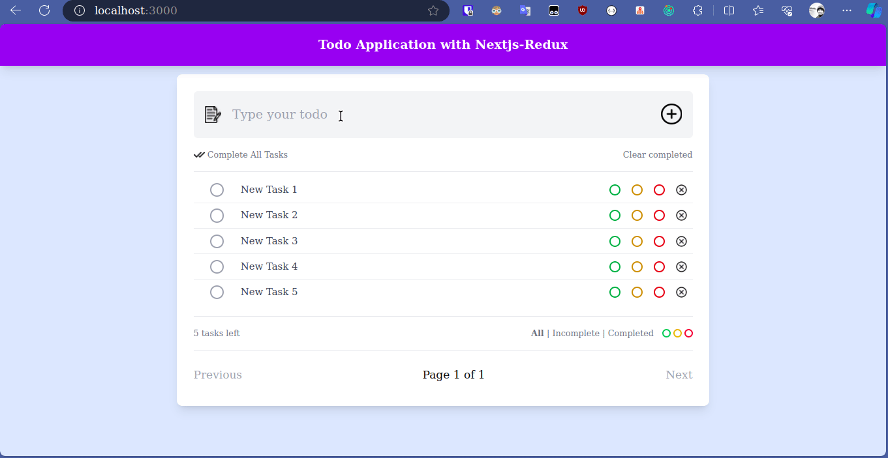

# To-do web application in Nextjs & Redux



## Introduction

Welcome to the Todo Application, a simple yet powerful tool to help you manage your tasks efficiently. This application allows you to add, update, delete, and view your todos with ease. Featuring color-based filtering for priority levels (high, medium, low), and status-based filtering (all, incomplete, completed), this app provides a comprehensive solution for task management. You can also mark all todos as completed with a single click and delete all completed tasks effortlessly. The application uses browser local storage as its database, ensuring your data is preserved across sessions.

## Table of Contents

- [Introduction](#introduction)
- [Features](#features)
- [Installation](#installation)
- [Usage](#usage)
- [Contact](#contact)

## Features

- Add, update, delete, and view todos
- Color-based filtering for priority levels (high, medium, low)
- Status-based filtering (all, incomplete, completed)
- Mark all todos as completed with one click
- Delete all completed todos
- Browser local storage used as database
- Pagination for managing large lists of todos

## Installation

Follow these steps to set up the project locally.

### Prerequisites

Ensure you have the following software installed on your machine:

- [Node.js](https://nodejs.org/en/)
- [Git](https://git-scm.com/)
- [Redux](https://redux.js.org/) (if not included in the project dependencies)

### Steps

1. **Clone the repository:**

   ```sh
   git clone https://github.com/I-am-Shibly/Todo-application-in-Nextjs-Redux.git

   cd Todo-application-in-Nextjs-Redux.git
   ```

2. **Install dependencies:**
   ```
   npm install
   ```

## Usage

To run the project locally, follow these steps:

1. **Start the development server:**

```
npm run dev
```

2. **Open your browser and navigate to:**

```
http://localhost:3000
```

## Contact

If you have any questions or suggestions, feel free to reach out to:

- **Email**: [iamshibly01@gmail.com](mailto:iamshibly01@gmail.com)
